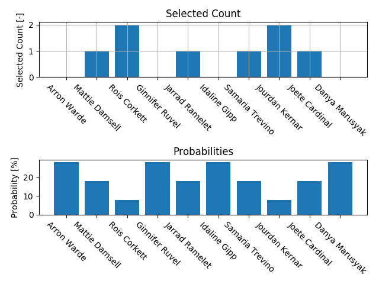

## Vyvolávač
Version: 0.1 beta

### Short description
The script takes an input file with student names and randomly selects a student. 
A selected student has then a lower probability of being selected again.
This script saves the state into an output file (which is read as input for the next iteration).

### Expected input/output:
File with full name (space separated), number of times the student was selected, 
and "points" from which the probability of being selected is calculated.
Fewer points mean a smaller probability of being selected.
The values should be tab-separated, thus the format should be:
`[Name space separated ]\t[selected count]\t[points]\n`


### Example input/output:
```
Arron Warde 0   27
Mattie Damsell  2   7
Rois Corkett    1   17
Ginnifer Ruvel  1   17
Jarrad Ramelet  1   17
Idaline Gipp    0   27
Samaria Trevino 0   27
Jourdan Kernar  1   17
Joete Cardinal  0   27
Danya Marusyak  1   17
```

**Note:** The initial file can contain only names and the script will add the numbers.

#### Plot:
The first plot shows how many times were the students selected. 
The second plot shows the students probabilities of being selected in the next round.



### Usage:
    python Vyvolavac.py input_stats.txt --save --plot

#### Flags:
 `-s`, `--save`:    Saves the statistics to the input file.
 
 `-p`, `--plot`:    Plots the new probability statistics.
